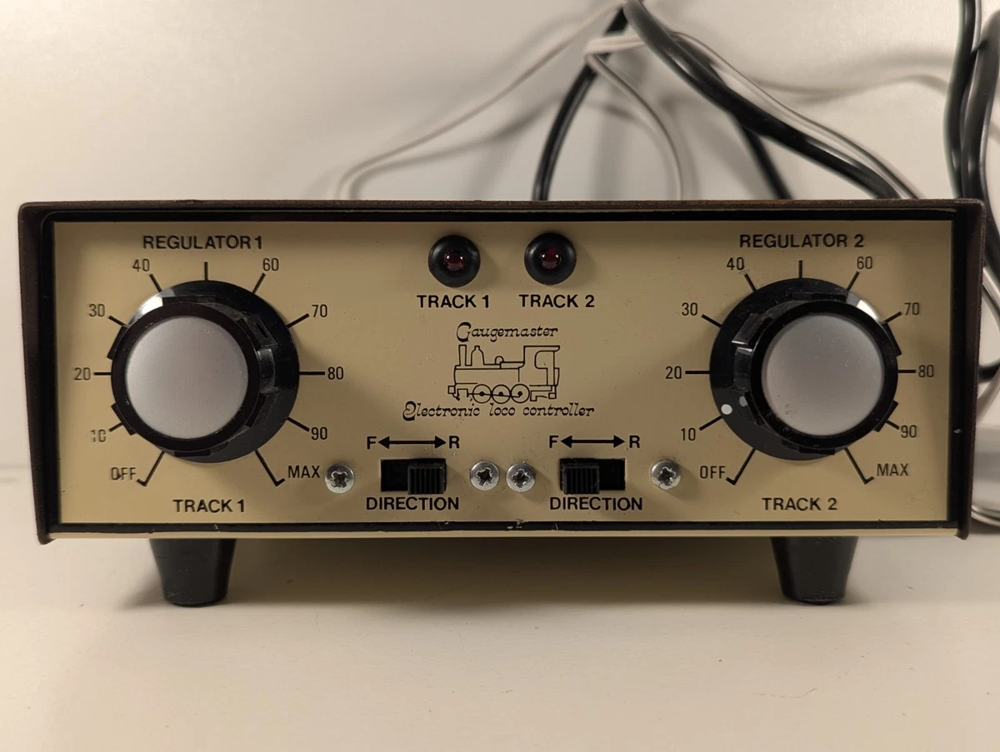

# Train-Controller

This repository is a wrapper repository for the Train Controller project. It aims to replace a Gauge Master Analogue Train Controller with a digital system using STM32 and Rust.

The Gauge Master Train Controller is shown below:

